# Polyglot Codebase Knowledge Graph

> Generated offline by **readmenator**. Supports C, C++, Python, Go, Rust, JS/TS, Java, C#, Shell, PHP, Dart, GDScript, Nim, ASM.
> No LLMs. No tokens. Pure static analysis. See more [here](https://github.com/grisuno/ReadMenator)

**Total Files Parsed:** 2 | **Total Symbols Extracted:** 4 | **Total Imports:** 7

## Structural Knowledge Map

```mermaid
graph TD
    classDef mod fill:#1e1e1e,stroke:#ff6666,stroke-width:2px,color:#fff;
    classDef cls fill:#2d2d2d,stroke:#4ec9b0,stroke-width:2px,color:#fff;
    classDef fn fill:#333,stroke:#dcdcaa,stroke-width:1px,color:#dcdcaa;
    classDef ext fill:#111,stroke:#666,stroke-dasharray:5 5,color:#aaa;
    app_py["app.py (py)"]
    class app_py mod;
    app_py_obtener_tasa_muestreo_valida["obtener_tasa_muestreo_valida"]
    class app_py_obtener_tasa_muestreo_valida fn;
    app_py --> app_py_obtener_tasa_muestreo_valida
    app_py_reproducir_tono["reproducir_tono"]
    class app_py_reproducir_tono fn;
    app_py --> app_py_reproducir_tono
    app_py_generar_y_reproducir["generar_y_reproducir"]
    class app_py_generar_y_reproducir fn;
    app_py --> app_py_generar_y_reproducir
    app_py_main["main"]
    class app_py_main fn;
    app_py --> app_py_main
    install_sh["install.sh (sh)"]
    class install_sh mod;
    ext_numpy["numpy"]
    class ext_numpy ext;
    app_py -.->|imports| ext_numpy
    ext_sounddevice["sounddevice"]
    class ext_sounddevice ext;
    app_py -.->|imports| ext_sounddevice
    ext_time["time"]
    class ext_time ext;
    app_py -.->|imports| ext_time
    ext_rich_console["rich.console"]
    class ext_rich_console ext;
    app_py -.->|imports| ext_rich_console
    ext_rich_progress["rich.progress"]
    class ext_rich_progress ext;
    app_py -.->|imports| ext_rich_progress
    ext_rich_prompt["rich.prompt"]
    class ext_rich_prompt ext;
    app_py -.->|imports| ext_rich_prompt
    ext_threading["threading"]
    class ext_threading ext;
    app_py -.->|imports| ext_threading
```

---

## Architecture Reference

### PY (1 files)

#### `app.py`
**Path:** `app.py`

**Functions:**
- `obtener_tasa_muestreo_valida` (line 35) `def obtener_tasa_muestreo_valida(dispositivo)` - *Obtiene una tasa de muestreo válida para el dispositivo*
- `reproducir_tono` (line 43) `def reproducir_tono(tono, dispositivo, tasa_muestreo)` - *Función para reproducir en segundo plano*
- `generar_y_reproducir` (line 55) `def generar_y_reproducir(frecuencia_izquierda, frecuencia_derecha, duracion, amplitud, dispositivo)` - *Genera y reproduce un tono mono o binaural*
- `main` (line 100) `def main()`

### SH (1 files)

#### `install.sh`
**Path:** `install.sh`

*No symbols extracted*
